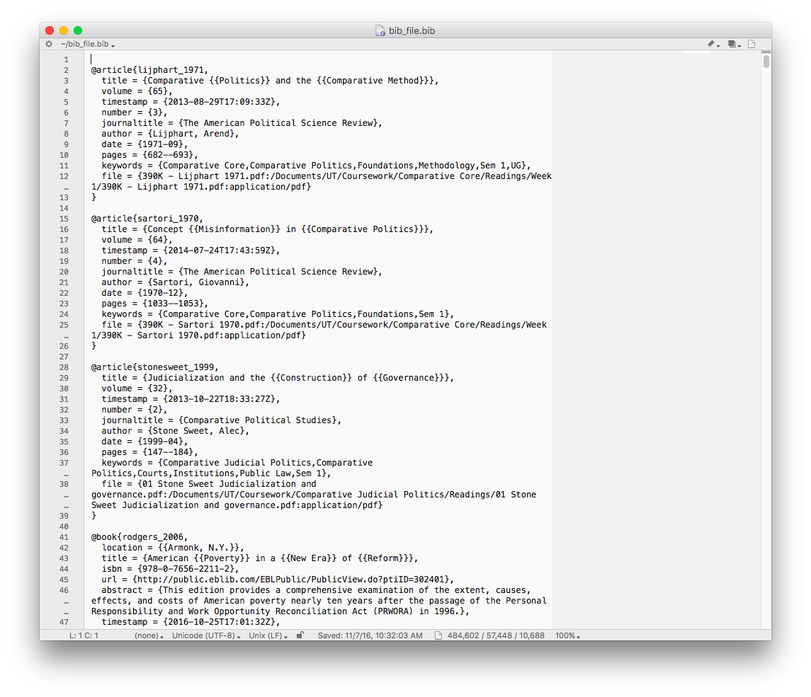
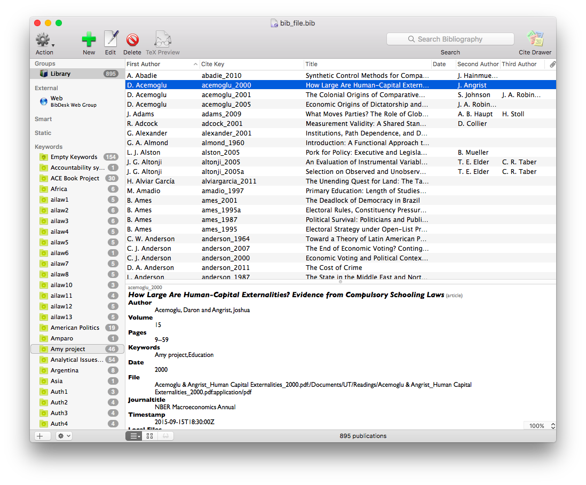
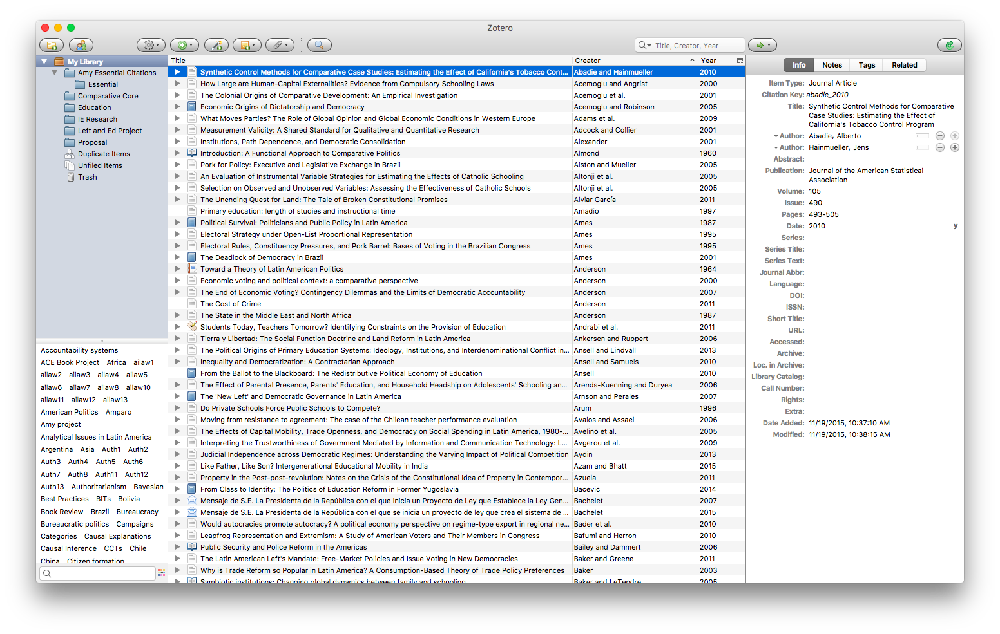
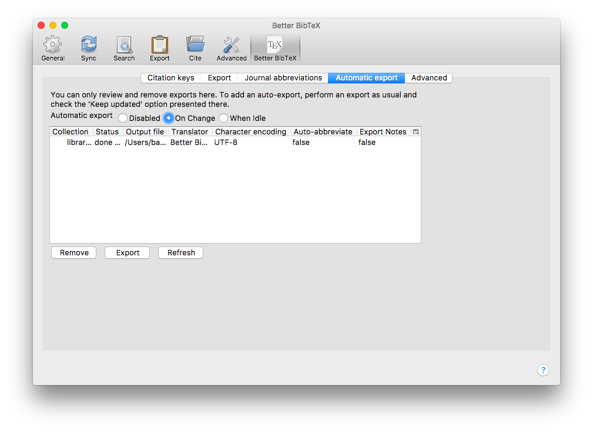

# Overview
## Dealing with Bibliographies in \LaTeX

* There are three general concerns
    + Generating (and maintaining) a "Bib" file
    + Entering citations into your document
    + Getting \LaTeX to turn the first two concerns into something usable
* Other tweaks
    + Specific formatting requirements

# The Bib File
## What is a "Bib" File?
* A bib file, noted with a `.bib` extension, is a plain text file that contains a list of your citations
    + These entries include
        * Author
        * Title
        * Etc.
        * Citekey

## Example Bib File


## How to Make a bib file
* Do it by hand
    + Google Scholar makes getting the citation easy
    + But it means that all you end up with is this goofy file
* Use a .bib file app manager like BibDesk
    + Relatively easy to use
    + Adds tools like keywords and groups

## BibDesk


## How to Make a bib file
* Use a full "point-and-click" manager like Zotero or Mendeley

## Zotero


## Zotero (or similar)
* Advantages
    + Easy to use
    + Complex groups/collections/tags
    + Notes
    + Attach files and index them for search
    + Has options for Word, if you ever need to go that route
* Disadvantages
    + Can slow down with larger bibliographies
    + "Point-and-click" convenience is ultimately slower
    + Possibly not future-proof

## My Zotero Use


## My Zotero Use
* Adjust my citation key default
* Automatic export to bib file

# Citations - Overview
## Natbib vs BibLaTeX
* There are two citation packages options: "natbib" and "biblatex"
    + They use different backend programs to process the citations (bibtex and biber, respectively)
    + The differences are pretty small between the two, but there are some incompatibilities
* You have to make a choice up front when generating your bib file
    + The choice will affect what you put into your \LaTeX file, but other than that it shouldn't matter very much

# Citations Using natbib
## The Preamble
* `\usepackage{natbib}`
* Well that's easy!

## Citations in the Document
* `\citep{<citekey>}` for an parenthetical citation
* `\citep[<pages>]{<citekey>}` for parenthetical with a page citation
* `\citet{<citekey>}` for a text citation
* `\citeyear{<citekey>}` for just the year citation
* There are some other options, but these are the most common

## References Page

```
\clearpage % to add a page break
\bibliographystyle{apsr} % assuming you have apsr.bst saved in the correct location
\bibliography{<your_bib_file>}
```

## Compiling into a pdf
* To compile within TeXworks (or similar):
    + Compile once as pdfLaTeX
    + Compile a second time as BibTeX
    + Compile a third time as pdfLaTeX
    + Compile a fourth time as pdfLaTeX

## Some Notes on natbib
* There are lots of style files out there
    + You can save it in the working directory for your document or `~/Library/texmf/bibtex/bst` for global access (on Mac, not sure about Windows)
* The bib file should also be placed in the working directory for your document
    + If it's not, you can use an absolute path to direct \LaTeX to it
* But it struggles with foreign characters

# Citations Using biblatex
## The Preamble
* `\usepackage[style=authoryear, url=false, doi=false]{biblatex}`
* `\addbibresource{<your_bib_file>}`
* Also pretty easy!
    + Note the second line implies you could use multiple bib files

## Citations in the Document
* `\autocite{<citekey>}` for almost everything
* `\textcite{<citekey>}` for a text citation
* `\autocite[<page_no>]{<citekey>}` also works for page numbers
* You can also use things like `\citeyear{}` if you need

## References Page
```
\clearpage % to add a page break
\printbibliography
```

## Compiling into a pdf
* To compile within TeXworks (or similar):
    + Compile once as pdfLaTeX
    + Compile a second time with biber (may require extra setup)
    + Compile a third time as pdfLaTeX
    + Compile a fourth time as pdfLaTeX

## Some Notes on biblatex (ht: [JAB](http://www.jabranham.com))
* Although it solves problems with foreign/unicode characters, it has some limitations/quirks
* No deep library of citation style files (but, honestly, who cares?)
* Default is to put "In:" before the journal name; solve with (one line)
    + `\renewbibmacro{in:}{\ifentrytype{article}{}
      {\printtext{\bibstring{in}\intitlepunct}}}`

## Also this:
* Inconsistent period placement with quotation marks; solve with:
    + `\usepackage[american]{babel}`
    + And to avoid a warning, also add `\usepackage{csquotes}`


# Other Considerations
## Isn't there an easier way to compile!?
* If you happen to be using a .Rnw file in RStudio, then when you "knit" that, it will do all four steps for you in one fell swoop
* If you compile from the command line, you can run `latexmk <yourfile.tex>`
    + This allows you to set extra flags like `-xelatex` or `-c`

## Some cool tricks (ht: JAB)
* Load the hyperref package at the very end of your preamble to automatically link your text citations with your reference list
    + `\usepackage{hyperref}`
    + Fix its ugly box default and make links colored words instead by adding this immediately after:
        * `\hypersetup{colorlinks=true}`

## One more trick (thanks again Alex)
* If you keep a DOI in your bib file for your entries, you can link the title of each entry to the DOI

```
\newbibmacro{string+doi}[1]{%
  \iffieldundef{doi}{#1}{\href{http://dx.doi.org/\thefield{doi}}{#1}}}
\DeclareFieldFormat{title}{\usebibmacro{string+doi}{\mkbibemph{#1}}}
\DeclareFieldFormat[article]{title} % should be one line with next
{\usebibmacro{string+doi}{\mkbibquote{#1}}}
```
## There are lots of options for everything
* JFGI
